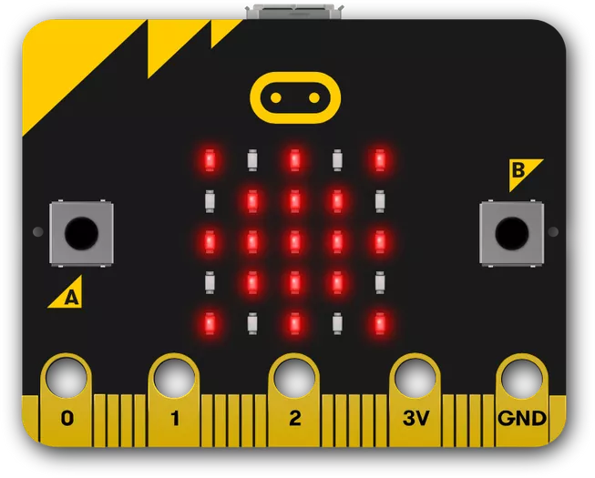
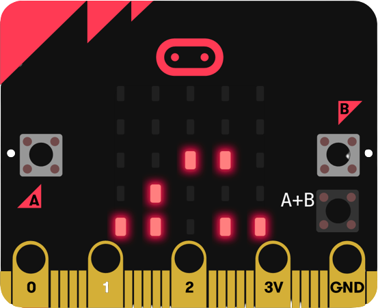
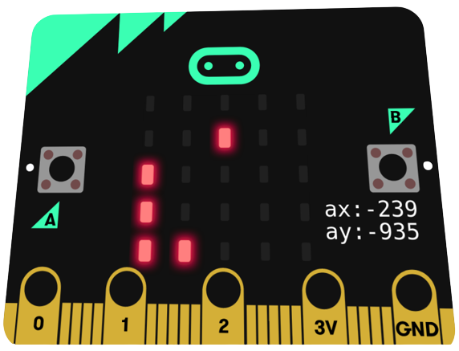

<h1 align="center">
  <a href="https://microbit.org/">micro:bit</a> games
</h1>

  
  
  

  This repo contains several games written in TypeScript for micro:bit chips

<h2 align="center">
  
👾 Running

</h2>

1. Open game directory in this repo
2. Download `.hex` file
3. Follow steps `6+` from the next paragraph

<h2 align="center">
  
🏗 Building from source

</h2>

1. Go to <a href="https://makecode.microbit.org">MS MakeCode</a> and create new project
2. Go to the JavaScript tab on the top of the editor
3. Replace code field contents with the ones from the `game.ts` file.  
   The `microbit.d.ts` file is a file with global typings to code in VSCode with autocomplete instead of an error, it's not required
4. Ensure code works by running the program in an emulator on the left (green triangle)
5. Press `Download` in the lower-left corner
6. Connect your micro:bit chip via USB
7. Open the `MICROBIT` device from your file manager
8. Drop the downloaded `.hex` file to the opened device. It will disappear and appear in read-only mode later.  
   <b>IMPORTANT</b>: do NOT unplug the chip while the indicator there is blinking.
9. At the end of the indicator flashing unplug and turn on your micro:bit.  
    
Game should start. Use the toggle to turn on/off chip, the bottom button to restart game. Game controls specified in the game description paragraph

<h1 align="center">
  
<a href="https://github.com/ExposedCat/microbit-games#--tetris">Tetris</a>

</h1>

  

<h3 align="center">
  
Controls

</h3>

0. Go to directory `tetris` in this repo
1. Press `Left button (A)` to move block left
2. Press `Right button (B)` to move block right
3. Press `Both buttons (AB)` to rotate block

<h1 align="center">
  
<a href="https://github.com/ExposedCat/microbit-games#--snake">Snake</a>

</h1>

  

<h3 align="center">
  
Controls

</h3>

0. Go to directory `snake` in this repo
1. Tilt chip to turn the snake

<h1 align="center">
  📃 License
</h1>

Do just what you want with this code. No one cares 🥱